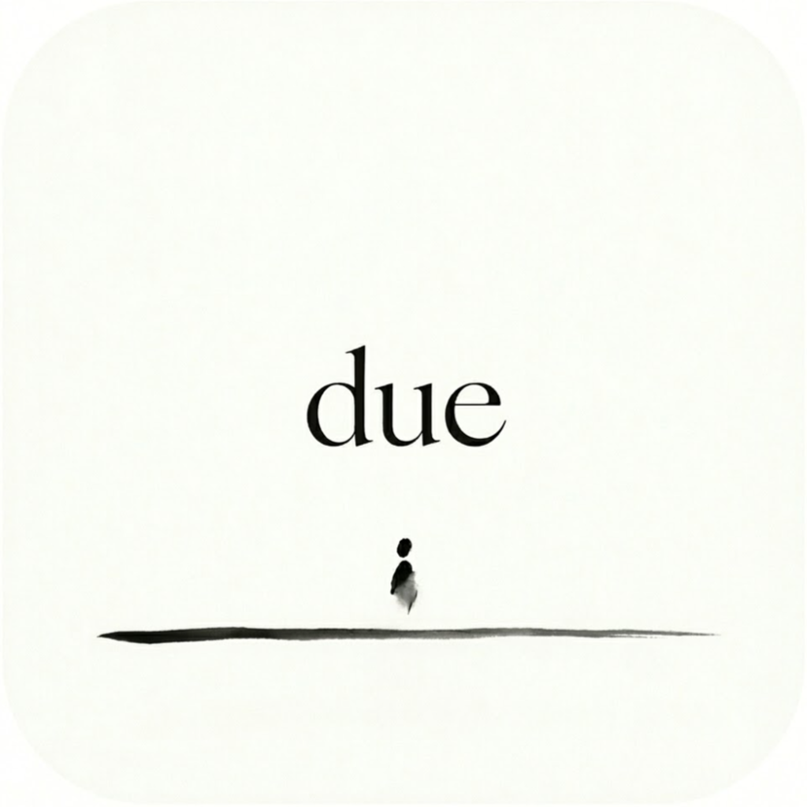

# Due


Due 是一个面向备考学生的 Flutter 应用，用来管理考试倒计时、复习天数、专注学习记录和院校公告监控。

## 功能

- 日期倒计时：首页展示目标考试剩余天数，支持多个重要日期。
- 复习记录：记录复习开始日，展示已坚持复习天数。
- 专注计时：支持 45 分钟和无限计时，保存学习时长、备注和分类。
- 学习统计：按日、周、月、年查看专注时长分布和分类统计。
- 院校监控：配置院校公告源和关键词，手动检查命中记录并打开原文。
- 桌面组件：Android AppWidget 和 iOS WidgetKit 展示已选择的倒计时。

## 下载

发布包会放在 GitHub Releases：

- Android：下载 `apk` 后直接安装。
- iOS：下载未签名 `ipa`，使用 SideStore / AltStore 自行签名安装。

> iOS 侧载用户需要使用自己的 Apple ID 签名。免费开发者签名通常需要定期续签。

发布新版本：

```bash
git tag v1.0.0
git push origin v1.0.0
```

GitHub Actions 会自动构建并上传 `Due-android.apk` 和 `Due-ios-unsigned.ipa`。

## 从源码运行

环境要求：

- Flutter 3.x
- Dart 3.x
- Android SDK
- iOS 构建需要 macOS + Xcode

安装依赖：

```bash
flutter pub get
```

运行测试：

```bash
dart analyze
flutter test
```

构建 Android APK：

```bash
flutter build apk --release
```

构建未签名 iOS App：

```bash
flutter build ios --release --no-codesign
```

如果要手动打包未签名 IPA：

```bash
mkdir Payload
cp -R build/ios/iphoneos/Runner.app Payload/
zip -r Due-ios-unsigned.ipa Payload
```

## iOS App Group

仓库默认使用：

- Bundle ID：`com.example.due`
- App Group：`group.com.example.due`

如果你改了 Bundle ID，也要同步修改 iOS Runner 和 Widget Extension 的 App Group 配置。

## 开发状态

当前本地验证：

- `dart analyze`
- `flutter test`
- `flutter build apk`

iOS 构建需要在 macOS 或 GitHub Actions 的 macOS runner 上验证。
