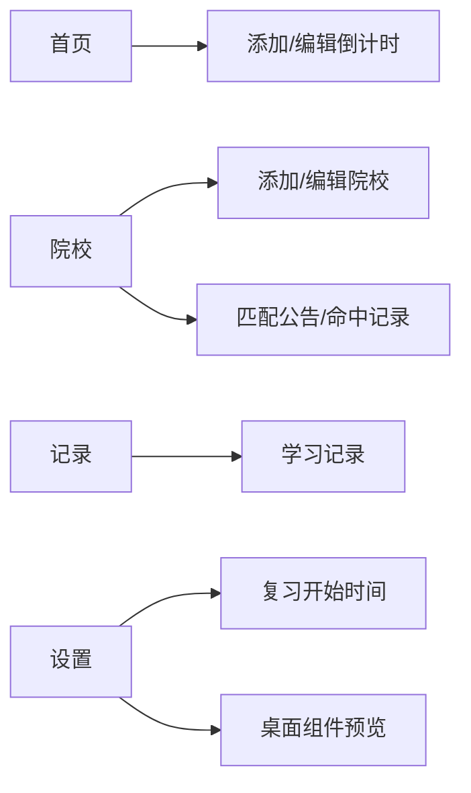

# Due 记录与专注计时功能 Spec

## 背景

当前 Due 已有首页倒计时、复习开始时间、院校信息监控、设置与 Widget 能力。用户确认“命中记录”不应作为底部一级功能，应归入院校监控；同时希望新增底部一级页面“记录”，用于专注学习计时与学习记录查看。

本需求先规划产品逻辑与实现闭环，UI 美化后续单独处理。本轮只参考用户提供图片的结构：专注计时主页面采用大圆环计时布局；学习记录页参考周/月/年统计与表格布局。

## 目标

- 底部导航调整为：首页、院校、记录、设置。
- “记录”主页面提供专注学习计时。
- 记录主页面底部统计改为“今日专注次数”和“今日累计时长”。
- 今日统计只按本地当天数据汇总，不展示跨日累计。
- 右上角提供“学习记录”入口，跳转到学习记录页。
- 学习记录页提供日/周/月/年维度查看、汇总卡、分布条形展示、数据表格。
- 专注记录持久化到 Hive，支持应用重启后查看历史。
- 后续反馈变更：专注时长仅保留 45 分钟和无限计时；计时支持备注和分类；学习记录页增加分类时长图；Android 锁屏通知提供暂停、继续、结束控制。

## 非目标

- 不在本轮做插画、天空背景、复杂动效或完整 UI 美化。
- 不接入云同步、账号系统或跨设备学习记录。
- 不做番茄钟多模式、白噪音、计划任务、科目体系的复杂管理。
- 不把院校命中记录移到“记录”页面；院校命中仍保留在院校监控内。

## 产品决策

| 项 | 决策 |
| --- | --- |
| 一级导航 | 首页 / 院校 / 记录 / 设置 |
| 记录页定位 | 学习行为记录，不承载院校公告命中 |
| 专注计时模式 | 45 分钟 / 无限计时 |
| 专注计时默认时长 | 45 分钟 |
| 今日专注次数 | 当天已保存的专注 session 数量 |
| 今日累计时长 | 当天已保存 session 的 duration 总和 |
| 当天定义 | 使用设备本地日期，按 session 结束时间归属当天 |
| 记录保存规则 | 用户完成或手动结束一次专注且时长大于 0 秒时保存 |
| 备注与分类 | 保存专注记录时写入备注和分类，未显式选择分类时可按备注关键词推断 |
| 锁屏控制 | Android 通知栏/锁屏通知提供暂停、继续、结束操作 |
| 重置规则 | 重置未保存的当前计时，不新增学习记录 |
| 学习记录入口 | 记录主页面 AppBar 右上角按钮 |

## 信息架构

## 数据模型

新增 `StudySession`：

| 字段 | 类型 | 说明 |
| --- | --- | --- |
| `id` | `String` | uuid |
| `startedAt` | `DateTime` | 专注开始时间 |
| `endedAt` | `DateTime` | 专注结束时间 |
| `durationSeconds` | `int` | 实际专注秒数 |
| `plannedSeconds` | `int?` | 计划秒数；45 分钟为 2700，无限计时为 null |
| `note` | `String` | 用户备注 |
| `category` | `String` | 学习分类 |
| `createdAt` | `DateTime` | 创建时间 |

Hive 新增 box：`study_sessions`。

## 页面行为

| 页面 | 行为 |
| --- | --- |
| 记录主页面 | 显示 45:00 或无限计时圆环、开始/暂停/继续/结束/重置按钮 |
| 记录主页面 | 提供备注输入和分类选择 |
| 锁屏通知 | 提供暂停、继续、结束操作，动作回传 Flutter 计时状态 |
| 记录主页面 | 显示今日专注次数、今日累计时长 |
| 记录主页面 | 右上角点击进入学习记录 |
| 学习记录页 | 支持日/周/月/年切换 |
| 学习记录页 | 显示当前周期累计时长、日均时长或次数 |
| 学习记录页 | 用内置条形组件展示周期内分布，不新增图表依赖 |
| 学习记录页 | 用内置条形组件展示分类时长分布，不新增图表依赖 |
| 学习记录页 | 用表格展示日期、专注次数、累计时长 |

## 验收标准

| 编号 | 标准 |
| --- | --- |
| A1 | 底部导航有：首页、院校、记录、设置，点击可切换页面 |
| A2 | 院校命中记录仍只能从院校页进入，不作为底部一级入口 |
| A3 | 记录主页面默认展示 45:00 专注计时 |
| A3-1 | 记录主页面只提供 45 分钟和无限计时两种模式 |
| A3-2 | 无限计时从 00:00 正向计时 |
| A4 | 点击开始后计时状态变化；暂停后不继续减少；结束后保存记录 |
| A4-1 | 锁屏通知可暂停、继续和结束当前计时 |
| A4-2 | 结束时保存备注和分类 |
| A5 | 今日专注次数只统计本地当天结束的 session |
| A6 | 今日累计时长只统计本地当天结束的 session |
| A7 | 跨日历史不影响记录主页面今日统计 |
| A8 | 右上角学习记录入口可跳转到学习记录页 |
| A9 | 学习记录页日/周/月/年切换后汇总和表格随范围变化 |
| A9-1 | 学习记录页展示分类时长分布图 |
| A10 | `dart analyze`、`flutter test`、`flutter build apk` 通过 |

## 风险

| 风险 | 处理 |
| --- | --- |
| Timer 在 widget test 中不稳定 | 把计时状态与 session 保存逻辑放入 provider/controller，UI 测试只验证关键状态 |
| 当天统计跨时区或跨午夜歧义 | 明确使用设备本地日期，按 `endedAt` 归属当天 |
| 学习记录页过早复杂化 | 本轮只做时长、次数、表格和简单条形分布 |
| 底部导航影响既有路由测试 | 增加 router/nav 回归测试，保留已有子路由 |

## 回滚方案

- 回滚新增的 `StudySession` model、repository、provider、Hive box、记录页和学习记录页。
- 回滚 router 中底部导航 shell 与 `/record`、`/study-records` 路由。
- 保留现有首页、院校、设置和 Widget 功能不变。
